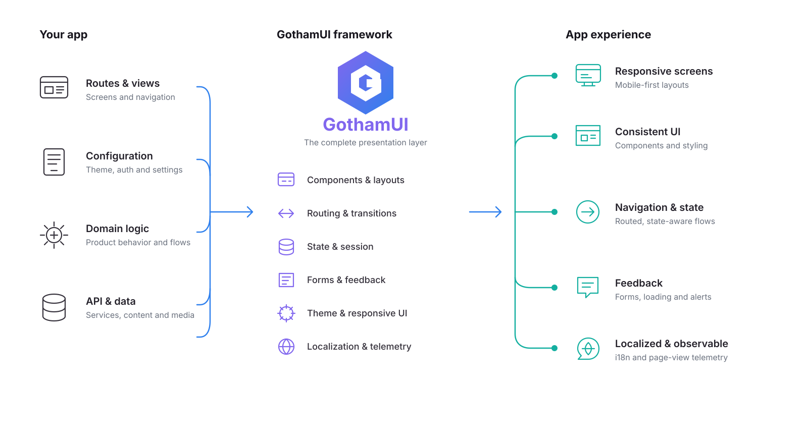

# GothamUI: The Complete Front-End UI Framework

> **GothamJS is now GothamUI.** Install `@nlabs/gothamui`. Existing component APIs and subpath exports are preserved. See the [migration guide](MIGRATION.md).


## Seamlessly integrating components, routing, state management, and transitions

> A comprehensive front-end UI framework that handles everything from component rendering to routing and smooth transitions with minimal configuration.

[](https://www.npmjs.com/package/@nlabs/gothamui)
[](https://www.npmjs.com/package/@nlabs/gothamui)
[](https://gothamui.nitrogenx.co)
[](https://github.com/nitrogenlabs/gothamui/issues)
[](https://github.com/ellerbrock/typescript-badges/)
[](http://opensource.org/licenses/MIT)
[](https://discord.gg/Ttgev58)

GothamUI is an all-inclusive React framework that unifies UI components, navigation, state management, and transitions into one cohesive system. Built by Nitrogen Labs, GothamUI eliminates the need to piece together multiple libraries, providing developers with a consistent, integrated solution for all front-end UI needs.

## How GothamUI fits into your app

Your application keeps ownership of its routes, configuration, domain logic, and data. GothamUI turns those inputs into a cohesive presentation layer with components, navigation, state, forms, responsive styling, localization, and telemetry built in.



## Key Features

- **Unified Component Library**: Beautifully designed, fully customizable UI components with consistent styling and behavior
- **Seamless Routing & Transitions**: Built-in navigation system with smooth page transitions and animations
- **Integrated State Management**: Flux-based state handling that connects directly to your UI components
- **Form System**: Complete form components with validation, error handling, and accessibility features
- **Theming & Styling**: Light/dark mode support and customizable design system based on Tailwind CSS
- **Responsive Design**: Mobile-first components that adapt beautifully to any screen size
- **Internationalization**: Built-in i18n support for multilingual applications
- **Authentication Flows**: Ready-to-use authentication UI components and routing guards
- **Icon Library**: Complete Lucide React icon set available for use throughout your application

## Getting Started

```bash
# Install GothamUI
npm install @nlabs/gothamui

# Or with yarn
yarn add @nlabs/gothamui
```

Create your first GothamUI application:

```jsx
import {createRoot} from 'react-dom/client';
import {Gotham} from '@nlabs/gothamui';

// Define your application configuration
const config = {
  app: {
    name: 'my-awesome-app',
    title: 'My Awesome App'
  },
  routes: [
    {
      path: '/',
      element: <HomePage />,
      props: {
        topBar: {
          logo: ,
          menu: [
            { label: 'Sign In', url: '/signin' },
            { label: 'Sign Up', url: '/signup' }
          ]
        }
      }
    }
  ]
};

// Render your application
const root = createRoot(document.getElementById('app'));
root.render(<Gotham config={config} />);
```

## CSS and Styling

GothamUI uses Tailwind CSS with custom theme variables for consistent styling. To use GothamUI components with proper styling in your project, you need to import the GothamUI theme CSS.

### Importing GothamUI Styles

```css
/* Import GothamUI theme CSS in your main CSS file */
@import '@nlabs/gothamui/styles/tailwind.css';
```

### Tailwind CSS v4 Configuration

Since GothamUI uses Tailwind CSS v4, configuration is done via CSS custom properties instead of a `tailwind.config.js` file. The GothamUI theme CSS already includes all the necessary color variables.

If you need to customize the theme further, you can override the CSS custom properties in your own CSS:

```css
/* In your main CSS file, after importing GothamUI styles */
@import '@nlabs/gothamui/styles/tailwind.css';

/* Override GothamUI theme variables */
@theme {
  --color-primary: #your-custom-primary;
  --color-secondary: #your-custom-secondary;
}
```

### Source Detection (Tailwind v4.2)

Tailwind v4.2 uses source detection instead of `content` arrays in JavaScript config.
GothamUI already includes `@source` for its own components, and your app can add sources in CSS when needed:

```css
/* src/styles/main.css */
@import '@nlabs/gothamui/styles/tailwind.css';

/* Optional: explicit app source paths (useful in monorepos/non-standard layouts) */
@source "../**/*.{js,jsx,ts,tsx}";
```

For PostCSS, use the Tailwind v4 plugin package (`@tailwindcss/postcss`):

#### Webpack Configuration

```js
// webpack.config.js
module.exports = {
  // ... other webpack config
  module: {
    rules: [
      {
        test: /\.css$/,
        use: [
          'style-loader',
          'css-loader',
          {
            loader: 'postcss-loader',
            options: {
              postcssOptions: {
                plugins: [
                  require('@tailwindcss/postcss')
                ]
              }
            }
          }
        ]
      }
    ]
  }
};
```

#### Lex Configuration

```js
// lex.config.mjs
export default {
  // ... other config
  tailwindCssPath: './src/styles/main.css'
};
```

#### Vite Configuration

```js
// vite.config.js
export default {
  css: {
    postcss: {
      plugins: [
        require('@tailwindcss/postcss')
      ]
    }
  }
}
```

### What Gets Imported

The GothamUI theme CSS includes:

- **Custom Color Palette**: Primary, secondary, neutral, success, error, warning, and info colors
- **Dark Mode Support**: Automatic dark mode variants for all colors
- **Typography**: Inter font family with proper font weights
- **Autofill Styles**: Browser autofill styling fixes for form inputs
- **Base Styles**: Essential CSS resets and utilities

### Using GothamUI Colors in Your Components

```jsx
// GothamUI colors are available as Tailwind classes
<div className="bg-primary text-white dark:bg-primary-dark dark:text-black-dark">
  Styled with GothamUI theme
</div>

// Or use them in custom CSS
.my-component {
  background-color: var(--color-primary);
  color: var(--color-white);
}
```

## Components

GothamUI provides a rich set of components to accelerate your development:

### Chat Components

GothamUI now includes a first-party chat UI module based on the `react-chat-elements` component set.

```tsx
// Option 1: Namespace import from root package
import {Chat} from '@nlabs/gothamui';

// Option 2: Direct chat subpath import
import {ChatList, MessageBox, MessageList} from '@nlabs/gothamui/chat';
```

Chat components inherit their runtime styles from GothamUI's Tailwind v4 stylesheet, so import [`@nlabs/gothamui/styles/tailwind.css`](#installation) once at your app entrypoint.

### Icons

GothamUI includes the complete [Lucide React](https://lucide.dev/) icon library, providing you with over 1000+ beautifully designed, customizable icons that follow a consistent design language.

#### Why Lucide React?

- **Consistent Design**: All icons follow the same design principles and stroke width
- **Customizable**: Easy to customize size, color, stroke width, and other properties
- **Accessible**: Built with accessibility in mind, including proper ARIA attributes
- **Tree Shakeable**: Only the icons you import are included in your bundle
- **TypeScript Support**: Full type definitions for all icons
- **Active Development**: Regularly updated with new icons and improvements

#### Quick Reference

- **Icon Gallery**: [Browse all available icons](https://lucide.dev/icons/)
- **Documentation**: [Lucide React documentation](https://lucide.dev/guide/packages/lucide-react)
- **GitHub**: [Lucide project on GitHub](https://github.com/lucide-icons/lucide)

#### Usage

```jsx
import { Camera, Heart, Star, Settings, LucideLoader } from '@nlabs/gothamui/icons';

const MyComponent = () => (
  <div>
    <Camera size={24} />
    <Heart size={24} color="red" />
    <Star size={24} fill="yellow" />
    <Settings size={24} />
    <LucideLoader size={24} /> {/* Use LucideLoader to avoid conflict with GothamUI Loader component */}
  </div>
);
```

#### Icon Properties

All Lucide React icons support these common properties:

```jsx
<Camera
  size={24}           // Icon size in pixels
  color="currentColor" // Icon color
  strokeWidth={2}     // Stroke width
  fill="none"         // Fill color
  className="my-icon" // CSS classes
/>
```

> **Note**: The `Loader` icon from Lucide React is exported as `LucideLoader` to avoid conflicts with GothamUI's `Loader` component.

### Optimized Form Components

GothamUI provides optimized form components with automatic validation, accessibility features, and performance optimizations:

```jsx
import { Button, Form, TextField } from '@nlabs/gothamui';
import { z } from 'zod';

// Define your form schema with Zod
const loginSchema = z.object({
  email: z.string().email('Please enter a valid email'),
  password: z.string().min(8, 'Password must be at least 8 characters')
});

const LoginForm = () => (
  <Form
    schema={loginSchema}
    onSubmit={handleSubmit}
    showErrors={true}        // Show form-level errors at top
    mode="onBlur"            // Validate on blur for better UX
  >
    {({isSubmitting, disabled}) => (
      <>
        <TextField
          name="email"
          label="Email"
          type="email"
          placeholder="Enter your email"
          required
        />
        <TextField
          name="password"
          label="Password"
          type="password"
          placeholder="Enter your password"
          required
        />
        <Button
          type="submit"
          variant="contained"
          color="primary"
          label="Sign In"
          disabled={isSubmitting}
          isLoading={isSubmitting}
        />
      </>
    )}
  </Form>
);
```

#### Optimized Form Features

- **Automatic Validation**: Integrated Zod schema validation with react-hook-form
- **Performance Optimized**: Efficient re-rendering and validation triggering
- **Accessibility**: Proper ARIA attributes and form structure
- **Loading States**: Use `Button` with `disabled` and `isLoading` during form submission
- **Error Handling**: Both field-level and form-level error display
- **Type Safety**: Full TypeScript support with inferred types

### Legacy Form Components

```jsx
import { Form, TextField, Button } from '@nlabs/gothamui';
import { z } from 'zod';

// Define your form schema with Zod
const loginSchema = z.object({
  email: z.string().email('Please enter a valid email'),
  password: z.string().min(8, 'Password must be at least 8 characters')
});

const LoginForm = () => (
  <Form
    schema={loginSchema}
    onSubmit={(data) => console.log('Form submitted:', data)}
  >
    <TextField
      name="email"
      label="Email"
      placeholder="Enter your email"
    />
    <TextField
      name="password"
      type="password"
      label="Password"
      placeholder="Enter your password"
    />
    <Button
      type="submit"
      variant="contained"
      color="primary"
      label="Sign In"
    />
  </Form>
);
```

### Payment Method Panel

`PaymentMethodPanel` displays an empty or masked saved-payment state while your application owns the provider integration. It never collects or stores card credentials.

```tsx
import {PaymentMethodPanel} from '@nlabs/gothamui';

<PaymentMethodPanel
  brand="Visa"
  last4="4242"
  onAdd={openPaymentProvider}
  onRemove={removePaymentMethod}
/>
```

Use `isAdding` and `isRemoving` to represent provider operations. See the [payment-method documentation](./src/docs/payments.md) for empty states, customization, props, and the security boundary.

### UI Components

```jsx
import { Button, Notify, Loader } from '@nlabs/gothamui';

// Stylish button with multiple variants
<Button
  variant="contained" // 'contained', 'outlined', or 'text'
  color="primary"     // 'primary', 'secondary', 'success', 'error', etc.
  size="md"           // 'sm', 'md', or 'lg'
  onClick={handleClick}
>
  Click Me
</Button>

// Show notifications
<Notify
  message="Operation completed successfully!"
  severity="success" // 'success', 'info', 'warning', or 'error'
  autoHideDuration={5000}
/>

// Loading indicator
<Loader size="md" />
```

### Markdown

`Markdown` is a lightweight wrapper around `react-markdown` for rendering inline or remote Markdown with optional template values:

```tsx
import {Markdown} from '@nlabs/gothamui';

<Markdown
  content="# GothamUI {{version}}\nAll UI components are publicly exported."
  values={{version: '1.5.4'}}
/>
```

### Image Upload and Paste

`DropUpload` includes a **Paste image** button next to the file browser. Pasted
images use the same `accept`, `maxFileSize`, `maxFiles`, resizing, preview, and
`onFilesChange` behavior as selected or dropped files.

```tsx
<DropUpload
  accept="image/*"
  browseLabel="Browse files"
  label="Drop an image here"
  maxFileSize={5_000_000}
  multiple={false}
  onFilesChange={handleFilesChange}
/>
```

Use `pasteLabel` to customize the button text, or `showPasteButton={false}` to
hide it. Clipboard reading requires HTTPS (or localhost) and may prompt for
permission. If access is unavailable or denied, focus the uploader or one of
its buttons and press Ctrl+V / ⌘V instead. Keyboard paste works independently of
the button and respects a custom `onPaste` handler calling `preventDefault()`.
Text and image URLs are not converted into image files.

### Code Editor

Monaco 0.56.0 pins DOMPurify to vulnerable version 3.4.8. Until Monaco updates
that dependency, merge this override into your application's root `package.json`,
then run `npm install` and `npm audit`:

```json
{
  "overrides": {
    "monaco-editor": {
      "dompurify": "^3.4.15"
    }
  }
}
```

GothamUI applies this override for its own development, but npm does not inherit
overrides from installed libraries. Applications need the override even when
they do not import the editor, because Monaco is a package dependency. This
updates the npm dependency tree; it does not update a separately CDN-loaded Monaco.

`CodeEditor` is GothamUI's shared Monaco editor integration. Import it from the dedicated editor entry point so applications that do not use Monaco keep it out of their normal component imports:

```tsx
import {CodeEditor} from '@nlabs/gothamui/editor';

<CodeEditor
  height="400px"
  language="json"
  options={{minimap: {enabled: false}, wordWrap: 'on'}}
  value="{}"
/>
```

### Public Views

Every GothamUI view is part of the public package API. Import views from the package root or from the dedicated `views` entry point:

```tsx
import {DefaultView, Markdown} from '@nlabs/gothamui';
// Or: import {DefaultView} from '@nlabs/gothamui/views';

const ReleaseNotes = () => (
  <DefaultView title="Release notes">
    <Markdown content="# Release notes" />
  </DefaultView>
);
```

The public view exports are `AuthSignInView`, `AuthSignUpView`, `AuthView`, `DefaultView`, `Gotham`, `GothamProvider`, `GothamRoot`, `HomeView`, `LoaderView`, `MenuView`, and `NotFoundView`.

## State Management

GothamUI uses ArkhamJS, a Flux implementation, for state management:

```jsx
import {useFlux} from '@nlabs/arkhamjs-utils-react';
import {GothamActions} from '@nlabs/gothamui';

const MyComponent = () => {
  const flux = useFlux();

  // Navigate to a new route
  const handleNavigation = () => {
    GothamActions.navGoto('/dashboard');
  };

  // Show a notification
  const showNotification = () => {
    GothamActions.notify({
      message: 'This is a notification',
      severity: 'info'
    });
  };

  // Show/hide loading indicator
  const startLoading = () => {
    GothamActions.loading(true, 'Loading data...');

    // After operation completes
    setTimeout(() => {
      GothamActions.loading(false);
    }, 2000);
  };

  return (
    <div>
      <Button onClick={handleNavigation} label="Go to Dashboard" />
      <Button onClick={showNotification} label="Show Notification" />
      <Button onClick={startLoading} label="Start Loading" />
    </div>
  );
};
```

## Routing

GothamUI simplifies routing with React Router integration:

```jsx
const config = {
  routes: [
    {
      path: '/',
      element: <HomeView />,
      props: {
        // Props passed to the component
      }
    },
    {
      path: '/dashboard',
      element: <DashboardView />,
      authenticate: true, // Requires authentication
      children: [
        {
          path: 'profile',
          element: <ProfileView />
        },
        {
          path: 'settings',
          element: <SettingsView />
        }
      ]
    }
  ]
};
```

## Authentication

GothamUI provides built-in authentication support:

```jsx
const config = {
  // Define authentication check function
  isAuth: () => Boolean(localStorage.getItem('token')),
  routes: [
    {
      path: '/protected',
      element: <ProtectedView />,
      authenticate: true // This route requires authentication
    }
  ]
};
```

## Internationalization

Easy internationalization with i18next:

```jsx
const config = {
  translations: {
    en: {
      greeting: 'Hello, {{name}}!',
      buttons: {
        submit: 'Submit'
      }
    },
    es: {
      greeting: '¡Hola, {{name}}!',
      buttons: {
        submit: 'Enviar'
      }
    }
  }
};

// In your component
import {useTranslation} from '@nlabs/gothamui';

const MyComponent = () => {
  const { t } = useTranslation();

  return (
    <div>
      <h1>{t('greeting', { name: 'User' })}</h1>
      <Button label={t('buttons.submit')} />
    </div>
  );
};
```

## Analytics

GothamUI can emit provider-neutral page views and UI events through an injected `awsRum` client. When paired with MetropolisJS, events are deduplicated, batched, and sent to a shared Reaktor analytics app.

```tsx
import {useAwsRum} from '@nlabs/gothamui';

const MyComponent = () => {
  const awsRum = useAwsRum();

  return (
    <button onClick={() => awsRum?.track({name: 'signup', type: 'click'})}>
      Sign up
    </button>
  );
};
```

Learn more in the [Analytics documentation](./src/docs/analytics.md).

## Theming

GothamUI supports light/dark mode and custom themes:

```jsx
const config = {
  displayMode: 'dark', // 'light' or 'dark'
  theme: {
    // Custom theme properties
    colors: {
      primary: '#3f51b5',
      secondary: '#f50057'
    }
  }
};
```

## Configuration

GothamUI is highly configurable:

```jsx
const config = {
  app: {
    name: 'my-app',
    title: 'My Application',
    logo: '/logo.svg',
    titleBarSeparator: '|'
  },
  baseUrl: '',
  storageType: 'local', // 'local' or 'session'
  middleware: [customMiddleware],
  stores: [customStore],
  onInit: () => {
    // Custom initialization logic
    console.log('App initialized');
  }
};
```

## Why Choose GothamUI?

- **UI Consistency**: Create visually cohesive applications with a unified design language
- **Developer Experience**: Spend less time wiring up libraries and more time building features
- **Reduced Bundle Size**: One framework instead of multiple libraries means optimized bundle size
- **Seamless Transitions**: Built-in animations and transitions between routes and UI states
- **Accessibility**: Components designed with accessibility in mind from the start
- **Rapid Development**: Go from concept to production with significantly less boilerplate code
- **TypeScript Support**: Full type definitions for enhanced developer experience

## Learn More

Visit our [official documentation](https://gothamui.nitrogenx.co) for comprehensive guides, API references, and examples.

## Using with Lex

GothamUI works seamlessly with [Lex](https://github.com/nitrogenlabs/lex), Nitrogen Labs' build and development toolkit. Lex provides optimized building, testing, and development workflows for projects using GothamUI.

### Installation

```bash
# Install Lex globally
npm install -g @nlabs/lex

# Or install locally in your project
npm install --save-dev @nlabs/lex
```

### Lex Project Configuration

Create a `lex.config.mjs` file in your project root:

```js
export default {
  entryJs: 'src/index.tsx',     // Your main entry point
  outputPath: './dist',         // Build output directory
  useTypescript: true,          // Enable TypeScript support
  jest: {
    setupFilesAfterEnv: ['<rootDir>/jest.setup.js'],
    testEnvironment: 'jsdom'
  }
};
```

### Development Workflow

```bash
# Start development server with hot reload
lex dev

# Build for production
lex compile

# Run tests
lex test

# Lint and fix code
lex lint --fix

# Update dependencies
lex update --interactive
```

### Integration with GothamUI

Lex automatically detects GothamUI projects and configures Tailwind CSS integration. Your `lex.config.mjs` will include:

```js
export default {
  // ... other config
  tailwindCssPath: './src/styles/main.css',  // Your main CSS file
};
```

### Build Optimization

Lex optimizes GothamUI builds by:

- **Tree Shaking**: Removes unused GothamUI components from your bundle
- **CSS Optimization**: Processes Tailwind CSS with GothamUI theme variables
- **TypeScript Compilation**: Optimized compilation with proper type checking
- **Asset Handling**: Automatic copying of GothamUI assets and fonts

### Example Project Structure

```text
my-gothamui-app/
├── src/
│   ├── index.tsx
│   ├── App.tsx
│   ├── styles/
│   │   └── main.css
│   └── components/
├── lex.config.mjs
├── package.json
└── tsconfig.json
```

### CSS Setup with Lex

In your `src/styles/main.css`:

```css
@import '@nlabs/gothamui/styles/tailwind.css';

/* Your custom styles */
@theme {
  /* Override GothamUI theme variables if needed */
}
```

Lex will automatically process this CSS file and include it in your build output.

## License

GothamUI is [MIT licensed](./LICENSE).
